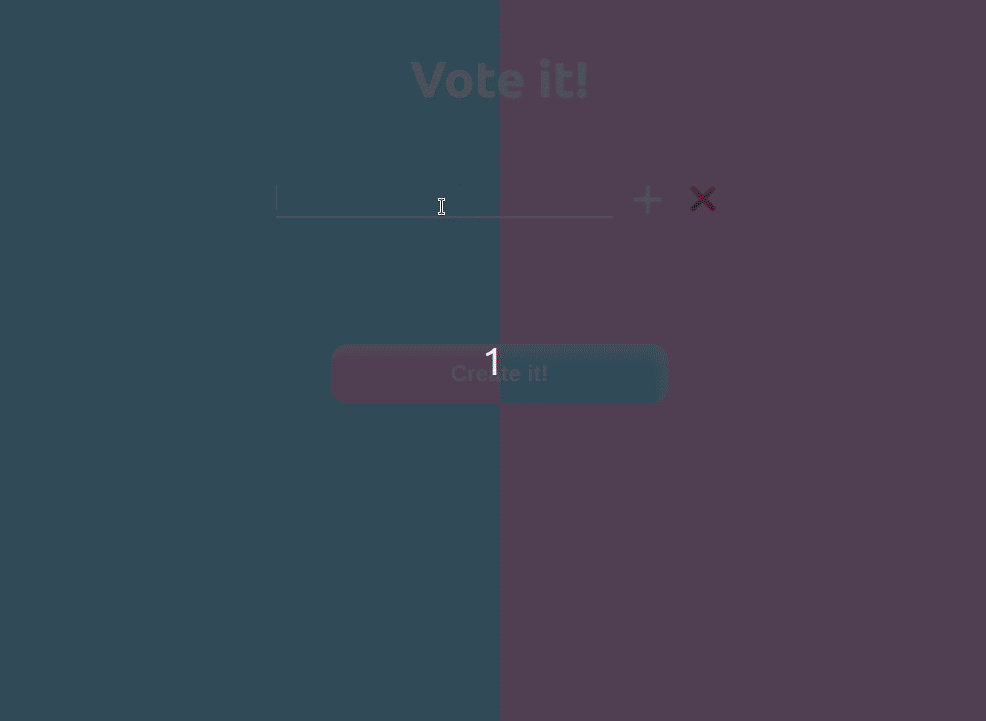

# Vote it!

Node version: v12.13.0

Minimal app using socket.io, express and React to vote

## How to run it

Once this repo is cloned:

`cd vote-it`

`yarn start` (to start the server)

`cd client`

`yarn start` (to start the client)

## Demo

